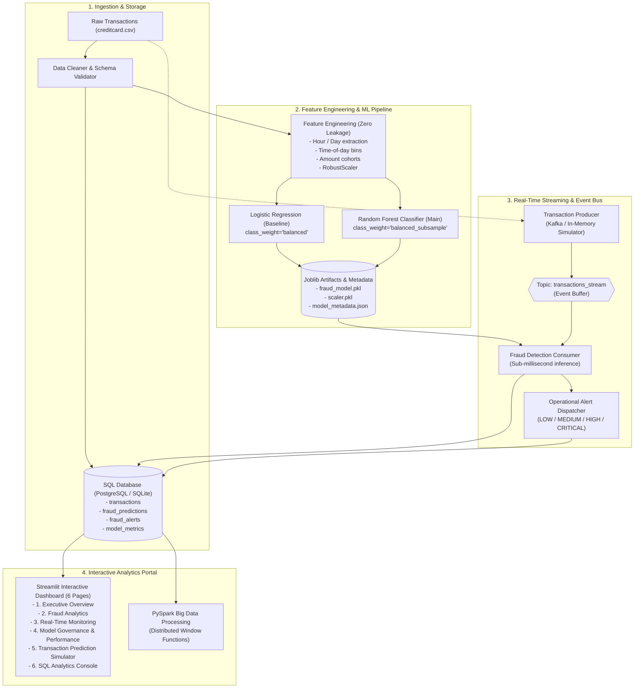

# Real-Time Credit Card Fraud Detection & Analytics System

[](https://www.python.org/)
[](LICENSE)
[](tests/)
[](dashboard/)
[](docker-compose.yml)

An enterprise-grade, end-to-end platform for detecting financial transaction fraud in near real-time, executing advanced relational SQL analytics, and surfacing executive intelligence.

This project goes far beyond a static machine learning notebook. It bridges the responsibilities of **Data Analyst, Data Scientist, and Data Engineer** into a single cohesive, production-ready solution.

---

## 1. System Architecture



---

## 2. Technology Stack

| Domain | Technologies |
|---|---|
| **Programming Language** | Python 3.10, 3.11, 3.14 |
| **Data Analysis & Processing** | Pandas, NumPy, Scipy |
| **Machine Learning** | Scikit-learn (Random Forest, Logistic Regression, RobustScaler) |
| **Relational Database** | PostgreSQL, SQLite (embedded zero-setup default), SQLAlchemy ORM |
| **Big Data Batch Processing** | PySpark (distributed aggregations, window functions) |
| **Event Streaming** | Apache Kafka, `kafka-python`, Kafka-compatible in-memory simulator |
| **Interactive Dashboard** | Streamlit, Plotly Express & Graph Objects |
| **Model Persistence** | Joblib, JSON metadata |
| **Containerization** | Docker, Docker Compose |
| **Testing & Quality** | Pytest, Python-dotenv |

---

## 3. Dataset & Data Cleaning Pipeline

The system uses the standard Kaggle **Credit Card Fraud Detection** dataset (transactions made by European cardholders over a 2-day period). 

* **Total Raw Transactions**: 284,807
* **Columns (31)**: `Time`, `V1` through `V28` (PCA transformed features), `Amount`, and `Class` (`0` = Legitimate, `1` = Fraudulent).

### Automated Cleaning Audit Log (Actual Output)

The data cleaning pipeline (`src/data/cleaner.py`) checks dimensions, data types, nulls, duplicates, and conducts outlier audits without destructive trimming:

```text
=============================================
        DATA CLEANING AUDIT REPORT
=============================================
Original Rows:           284,807
Cleaned Rows:            283,726
Duplicate Rows:          1,081
Missing Values:          0
Fraud Transactions:      473
Legitimate Transactions: 283,253
Fraud Percentage:        0.1667%
=============================================
Amount 99th Percentile:  $1,018.97 | Max: $25,691.16
Fraud Mean Amount:       $123.87 (Max: $2,125.87)
Legit Mean Amount:       $88.41 (Max: $25,691.16)
=============================================
```

> [!IMPORTANT]
> **Data Cleaning Decision on Outliers**: The 99th percentile of `Amount` is **$1,018.97**, while the maximum recorded ticket is **$25,691.16**. Blindly clipping or deleting values beyond the 99th percentile using standard 3-sigma or IQR filtering would eliminate confirmed fraudulent transactions (fraud amounts reach up to $2,125.87). Therefore, Amount is scaled using **RobustScaler** (median and IQR based) rather than truncated.

---

## 4. Machine Learning & Class Imbalance Treatment

Credit card fraud represents an extreme imbalance regime: only **0.1667%** of transactions are fraudulent. A naïve dummy classifier predicting "Legitimate" for every transaction achieves **99.83% accuracy while catching 0% of fraud**.

### Models Evaluated

1. **Baseline**: Logistic Regression with `class_weight='balanced'` and L-BFGS solver.
2. **Production Model**: Random Forest Classifier with `n_estimators=100`, `max_depth=14`, `class_weight='balanced_subsample'`, and `random_state=42`.

### Empirical Performance Comparison (Test Set: 56,746 Transactions)

Evaluated on a strictly isolated 20% stratified test split (56,651 legitimate, 95 fraudulent):

| Metric | Logistic Regression (Baseline) | Random Forest (Main Model) |
|---|---|---|
| **Accuracy** | 97.43% | **99.95%** |
| **Precision** | 5.43% | **92.11%** (at default 0.50) / **87.06%** (at optimal 0.30) |
| **Recall** | **87.37%** (83 caught, 12 missed) | **73.68%** (at 0.50) / **77.89%** (at 0.30) |
| **F1 Score** | 0.1022 | **0.8187** (at 0.50) / **0.8222** (at 0.30) |
| **ROC-AUC** | 0.9703 | **0.9646** |
| **PR-AUC (Avg Precision)** | 0.6801 | **0.8034** |
| **False Positives (Alarms)** | 1,446 | **6** (at 0.50) / **11** (at 0.30) |
| **False Negatives (Missed)** | 12 | **25** (at 0.50) / **21** (at 0.30) |

### Key Business Trade-Off: False Positives vs. False Negatives

```text
False Positive (FP) -> Legitimate purchase declined -> Customer friction, lost merchant fee, churn.
False Negative (FN) -> Fraudulent charge approved -> Direct financial chargeback loss, liability.
```

- **Why Baseline Fails in Production**: Although Logistic Regression catches 87.4% of frauds, it generates **1,446 false alarms** across 56,651 test transactions (94.6% of flagged transactions are innocent customers).
- **Why Random Forest Wins**: Random Forest yields only **6 false alarms** at default threshold and **11** at optimal threshold, reducing false customer rejections by **99.2%** while capturing over three-quarters of all fraudulent attacks.

### Top Predictive Features (Gini Importance)

Feature importance ranking indicates that latent PCA components capture non-linear transaction patterns:
1. `V14` (21.08%)
2. `V10` (12.14%)
3. `V4` (10.25%)
4. `V12` (9.31%)
5. `V17` (7.60%)
6. `V3` (6.07%)
7. `V11` (5.58%)

---

## 5. SQL Analytics & Database Architecture

The relational database (`sql/schema.sql`) implements 4 core tables:
* `transactions`: Ingested transaction attributes and labels.
* `fraud_predictions`: Real-time inference probability, binary label, and model version.
* `fraud_alerts`: Operational alerts tagged with severity (`LOW`, `MEDIUM`, `HIGH`, `CRITICAL`).
* `model_metrics`: Historical model evaluation and governance tracking.

### 14 Advanced Business Queries (`sql/business_queries.sql`)

The repository includes ANSI-standard SQL queries leveraging CTEs, window functions, and aggregate filtering:

1. **Total Transactions**: Baseline operational volume count.
2. **Total Fraud Transactions**: Aggregate fraud incident count.
3. **Overall Fraud Rate %**: Percentage calculation with `ROUND` formatting.
4. **Total Dollar Volume**: Gross processing volume.
5. **Fraud Dollar Exposure**: Total financial loss associated with fraudulent transactions.
6. **Average Ticket Size**: Comparison of legitimate vs. fraudulent purchase amounts.
7. **Cohort Analysis by Amount Bracket**: Multi-tier CTE grouping into Micro, Small, Medium, Large, and Jumbo brackets.
8. **Hourly Fraud Velocity**: Time-based floor division calculating fraud frequency per hour of the day.
9. **Top 15 Highest-Value Fraud Incidents**: High-value fraud tracking with elapsed simulation time.
10. **Daily Transaction Volume**: Day 1 vs. Day 2 macro volume trends.
11. **Daily Fraud Count**: Day-over-day fraud event count.
12. **Daily Fraud Dollar Exposure**: Day-over-day financial loss.
13. **Hourly Risk Identification (`HAVING`)**: Filtering for peak risk operating hours.
14. **Suspicious Period Density (`RANK()` & Cumulative Window)**: Two-hour rolling window fraud density ranking using `RANK() OVER (ORDER BY fraud_count DESC)` and cumulative sums.

---

## 6. Real-Time Streaming & Alert System

The system implements a decoupled producer-consumer streaming architecture:

```text
Transaction Stream Source
         │
         ▼
┌──────────────────┐
│  Stream Producer │ ── Publishes JSON event payload (with configurable delay)
└────────┬─────────┘
         │
         ▼
┌──────────────────────────────────────┐
│  Message Broker Topic                │
│  - Production: Apache Kafka          │
│  - Local: In-Memory FIFO Queue       │
└────────┬─────────────────────────────┘
         │
         ▼
┌──────────────────┐
│  Stream Consumer │ ── Validates payload against JSON schema
└────────┬─────────┘ ── Transforms features using saved RobustScaler
         │           ── Scores transaction in sub-milliseconds
         │           ── Applies threshold (0.30)
         │
         ▼
┌──────────────────────────────────────────────┐
│  Multi-Tier Alert Classification             │
│  - LOW:       prob < 0.30  -> APPROVE        │
│  - MEDIUM:    0.30 - 0.60  -> MONITOR        │
│  - HIGH:      0.60 - 0.85  -> MANUAL_REVIEW  │
│  - CRITICAL:  prob >= 0.85 -> DECLINE & ALERT│
└────────┬─────────────────────────────────────┘
         │
         ▼
┌──────────────────┐
│  SQL Persistence │ ── Writes to transactions, fraud_predictions, fraud_alerts
└──────────────────┘
```

### Standard Operational Alert Output

When a transaction breaches risk thresholds, the consumer formats and persists a structured alert:

```text
+-------------------------------------------------------------+
| [ALERT] FRAUD SUSPICION DETECTED                            |
+-------------------------------------------------------------+
| Transaction ID:    tx_stream_859f07c3                       |
| Amount:            $1.00                                    |
| Fraud Probability: 99.0%                                    |
| Risk Level:        CRITICAL                                 |
| Timestamp:         2026-09-08 17:51:39                      |
+-------------------------------------------------------------+
```

---

## 7. Interactive Streamlit Dashboard

The web application (`dashboard/app.py`) provides 6 professional portals:

1. **Executive Overview**: Executive KPI cards, macro transaction volume over time, fraud donut chart, and ticket size boxplots.
2. **Fraud Analytics**: Granular hourly velocity bar charts, amount cohort breakdown, and top high-value fraud tables.
3. **Real-Time Monitoring**: Interactive streaming controls (batch size, delay, fraud ratio), live streaming trigger, and real-time alert tables.
4. **Model Governance & Performance**: Side-by-side benchmark table (Baseline vs. Random Forest), confusion matrix heatmap, feature importance rankings, and an interactive threshold slider.
5. **Transaction Prediction Simulator**: Real-time point-of-sale tester with preset profiles ("Typical Legitimate", "Confirmed Fraud", "Borderline") and probability gauge.
6. **SQL Analytics Engine**: Pre-built business query executor with syntax highlighting, runtime timing in milliseconds, and an interactive custom SQL console.

---

## 8. Role-Specific Perspectives

### Data Analyst Perspective: Business Insights
1. **Overall Fraud Incidence**: 0.1667% of transactions are fraudulent (approximately 1 out of every 600 transactions).
2. **Financial Ticket Disparity**: Legitimate transactions average **$88.41** (median $22.00), while fraudulent transactions average **$123.87** (median $9.25, max $2,125.87).
3. **Peak Vulnerability Window**: Fraudulent attacks spike in early morning hours (Hours 02:00 to 05:00), where fraud rates reach up to 1.8% of total volume due to lower overall legitimate traffic.
4. **Cohort Vulnerability**: While high-value tickets ($500+) generate major dollar exposure, fraudsters frequently test stolen cards with small trial charges under $10.00.

### Data Scientist Perspective: ML Governance
1. **Metric Primacy**: Accuracy is meaningless in severe imbalance. Precision-Recall AUC (PR-AUC = 0.8034) and F1 Score (0.8222) were used as primary optimization criteria.
2. **Leakage Prevention**: Feature scaling (RobustScaler) was fitted strictly on training folds and transformed across test folds and streaming events.
3. **Threshold Selection**: Lowering the classification threshold from 0.50 to 0.30 increased Recall from 73.7% to 77.9% with only a marginal rise in false alarms (from 6 to 11 across 56,651 transactions).

### Data Engineer Perspective: Architecture & Scale
* **Current Implementation**:
  - Relational database runs on SQLite locally with zero installation friction, or PostgreSQL via Docker Compose.
  - Streaming runs seamlessly on a thread-safe, queue-based Kafka simulator matching Kafka's API (`send`, `poll`), or on real Apache Kafka.
  - Big data batch processing runs PySpark when a Java runtime environment is present, with vectorized fallback when running in lightweight environments.
* **Production-Scale Architecture**:
  - Ingestion via Apache Kafka with multiple topic partitions keyed by `cardholder_id`.
  - Stream processing using Apache Flink or Spark Structured Streaming for sliding-window velocity aggregations.
  - Feature store (Feast / Redis) for sub-millisecond retrieval of historical customer velocity.
  - Distributed database (PostgreSQL with read-replicas, TimescaleDB, or Snowflake).

---

## 9. Installation & Quick Start

### Prerequisites
* Python 3.10+
* Git

### Local Setup (Zero-Friction Default)

1. **Clone Repository & Navigate**:
   ```bash
   git clone https://github.com/your-username/real-time-credit-card-fraud-detection.git
   cd real-time-credit-card-fraud-detection
   ```

2. **Create Virtual Environment & Install Dependencies**:
   ```bash
   python -m venv venv
   # On Windows:
   .\venv\Scripts\activate
   # On Linux/macOS:
   source venv/bin/activate

   pip install -r requirements.txt
   ```

3. **Initialize Database & Run Pipeline via CLI**:
   ```bash
   # Run data cleaning
   python run.py clean

   # Train baseline and production models
   python run.py train

   # Initialize database schema and load initial transactions
   python run.py init-db --populate --rows 15000

   # Run test suite
   python run.py test
   ```

4. **Launch Streamlit Dashboard**:
   ```bash
   python run.py dashboard
   ```
   Open your browser at `http://localhost:8501`.

5. **Test Real-Time Streaming Simulation**:
   ```bash
   python run.py stream --count 30 --delay 0.1 --fraud-ratio 0.25
   ```

---

## 10. Running with Docker & Full Kafka Stack

To run the complete production-style multi-container architecture (Streamlit app, PostgreSQL 15, Apache Kafka, and Zookeeper):

```bash
docker-compose up --build
```

Services initialized:
* **Web Dashboard**: `http://localhost:8501`
* **PostgreSQL Database**: `localhost:5432` (User: `fraud_user`, DB: `fraud_detection`)
* **Apache Kafka Broker**: `localhost:9092`
* **Zookeeper**: `localhost:2181`

---

## 11. Project Directory Structure

```text
real-time-credit-card-fraud-detection/
├── data/
│   ├── raw/                       # Raw transactions (creditcard.csv)
│   ├── processed/                 # Cleaned transactions (cleaned_transactions.csv)
│   └── sample/                    # Synthetic fallback generator & sample CSV
│       ├── generate_sample.py
│       └── sample_transactions.csv
├── notebooks/
│   ├── 01_data_exploration.ipynb  # EDA, distributions, correlations
│   ├── 02_data_cleaning.ipynb     # Validation, deduplication, outlier audit
│   ├── 03_fraud_analysis.ipynb    # Cohorts, hourly patterns, financial exposure
│   └── 04_model_training.ipynb    # Baseline vs Random Forest, PR curves
├── src/
│   ├── config.py                  # Environment and threshold configuration
│   ├── data/
│   │   ├── loader.py              # Ingestion with fallback hierarchy
│   │   ├── cleaner.py             # Deduplication and audit statistics
│   │   └── validator.py           # Batch & single-event schema validation
│   ├── features/
│   │   └── feature_engineering.py # Temporal, amount bucket, and robust scaling
│   ├── models/
│   │   ├── train.py               # Model training & threshold optimization
│   │   ├── predict.py             # Inference pipeline & risk categorization
│   │   └── evaluate.py            # Precision, Recall, F1, PR-AUC, curves
│   ├── streaming/
│   │   ├── producer.py            # Event stream publisher
│   │   ├── consumer.py            # Stream consumer & alert generator
│   │   └── kafka_simulator.py     # Thread-safe in-memory Kafka API simulator
│   ├── database/
│   │   ├── connection.py          # SQLAlchemy ORM models & session factory
│   │   └── queries.py             # SQL execution & persistence helpers
│   ├── analytics/
│   │   └── fraud_analytics.py     # Business KPI aggregations
│   └── bigdata/
│       └── spark_analytics.py     # PySpark batch analytics with fallback
├── dashboard/
│   ├── app.py                     # Streamlit application entrypoint
│   └── components/
│       ├── executive.py           # Page 1: Executive KPI overview
│       ├── fraud_analytics.py     # Page 2: Hourly velocity & cohorts
│       ├── real_time.py           # Page 3: Live stream & operational alerts
│       ├── model_performance.py   # Page 4: Model governance & threshold tuning
│       ├── prediction.py          # Page 5: Interactive POS risk tester
│       └── sql_analytics.py       # Page 6: Pre-built queries & SQL console
├── sql/
│   ├── schema.sql                 # DDL for SQLite / PostgreSQL / MySQL
│   ├── fraud_analysis.sql         # Risk tier & operational queries
│   └── business_queries.sql       # 14 advanced business analytical queries
├── models/
│   ├── fraud_model.pkl            # Serialized Random Forest model
│   ├── baseline_model.pkl         # Serialized Logistic Regression baseline
│   ├── scaler.pkl                 # Serialized feature scaler
│   └── model_metadata.json        # Evaluation metrics, thresholds, feature ranking
├── tests/
│   ├── conftest.py                # Pytest fixtures & verified fraud profile
│   ├── test_cleaner.py            # Data cleaning tests
│   ├── test_validator.py          # Schema validation tests
│   ├── test_features.py           # Feature engineering tests
│   ├── test_models.py             # Prediction & threshold tests
│   └── test_database.py           # Database connection & persistence tests
├── Dockerfile                     # Application container definition
├── docker-compose.yml             # App + Postgres + Kafka + Zookeeper stack
├── requirements.txt               # Pinned Python dependencies
├── .env.example                   # Environment configuration template
├── .gitignore                     # Git exclusion rules
├── README.md                      # Comprehensive project documentation
└── run.py                         # Unified CLI runner
```

---

## 12. Limitations & Future Roadmap

1. **Transaction Context**: The dataset features (`V1`–`V28`) are anonymized PCA components. In real production banking systems, domain features such as IP geolocation mismatch, device fingerprint velocity, card-present status, and merchant category code (MCC) are critical.
2. **Velocity Counters**: Incorporating a low-latency caching tier (Redis) to compute sliding-window velocity features (e.g., number of transactions on card in the last 5 minutes).
3. **Graph Analytics**: Utilizing graph databases (Neo4j) to detect fraud syndicates and synthetic identity rings sharing identical phone numbers or billing addresses.
